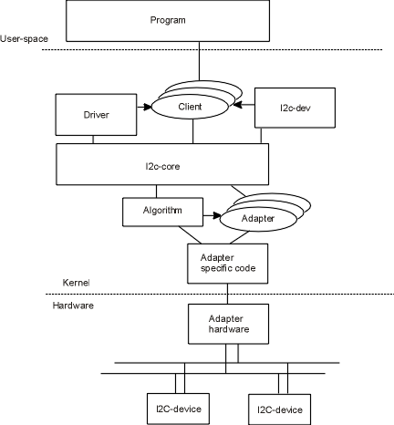

# vi2c-diva

## Introduction

**WIP**

The vi2c-diva project is trying to implement virtual I2C platform device "diva" and its device
driver. We'll try to understand the purpose of each component in the Linux I2C subsystem.

For traditional chinese users who want to learn more about this project, you
are welcome to check the [link](https://hackmd.io/@RinHizakura/BJDTZnUsF) for more
introduction of I2C. Welcome for any advice and discussion, thanks!

## Reference
* [Day 10：I2C Driver (Part 1) - 使用 Device Tree 來找 Driver](https://ithelp.ithome.com.tw/articles/10244211)
* [Implementing I2C device drivers](https://www.kernel.org/doc/html/latest/i2c/writing-clients.html)
* [How to instantiate I2C devices](https://www.kernel.org/doc/html/latest/i2c/instantiating-devices.html)
* [linux/drivers/i2c/busses/i2c-bcm2835.c](https://github.com/torvalds/linux/blob/master/drivers/i2c/busses/i2c-bcm2835.c)
